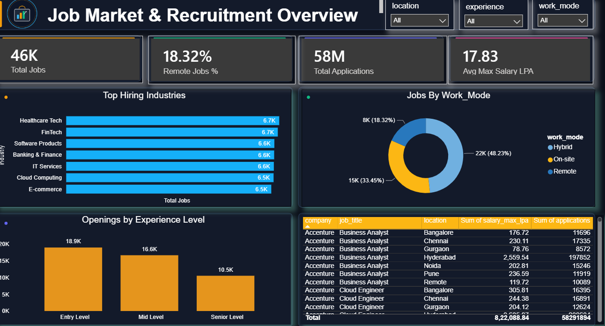
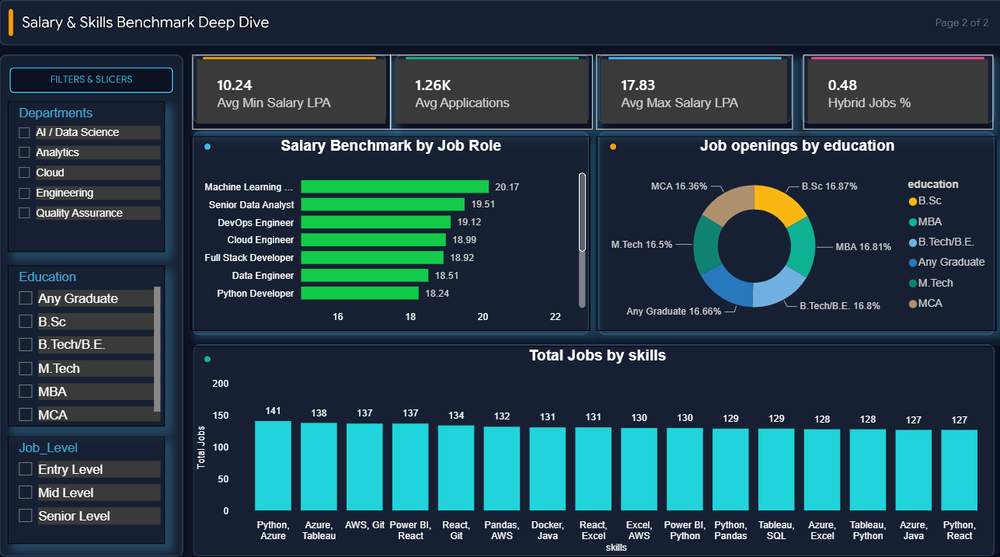

# 📊 Job Overview & Market Analysis Project

An end-to-end data analytics project designed to extract actionable insights from job market data, featuring automated data cleaning via Python and interactive business intelligence dashboards in Power BI.

---

## 🚀 Project Overview

Navigating the modern job market requires deep visibility into in-demand skills, salary distributions, and industry growth areas. The **Job Overview & Market Analysis Project** bridges raw employment data and strategic decision-making by cleaning datasets programmatically and presenting visual metrics through a dynamic, multi-page Power BI report.

---

## ✨ Features

* **Automated Data Cleaning:** Programmatically handles missing values, removes duplicates, and formats inconsistent text using Python.
* **Data Modeling:** Establishes robust relationships between structured datasets.
* **DAX Calculations:** Utilizes custom DAX measures to compute key performance indicators (KPIs) and analytical metrics.
* **Interactive Visualizations:** Multi-page Power BI dashboards featuring custom slicers, donut charts, bar graphs, and KPI cards.
* **Geographical & Skill Insights:** Highlights regional hiring trends and top-requested technical and soft skills.

---

## 🛠️ Tech Stack

* **Programming Language & Preprocessing:** Python, Google Colab, Pandas, NumPy
* **Data Visualization & Business Intelligence:** Power BI, DAX, Power Query
* **Version Control & Repository Management:** Git & GitHub

---

## 📸 Dashboard Preview

### Page 1 — Job Market & Recruitment Overview



### Page 2 — Salary & Skills Benchmark



---

## 📂 Project Structure

```text
job-overview-project/
│
├── dashboards/               # Power BI report file (.pbix)
├── notebooks/                # Google Colab data cleaning notebook (.ipynb)
├── images/                   # Dashboard preview screenshots
└── README.md                 # Project documentation
